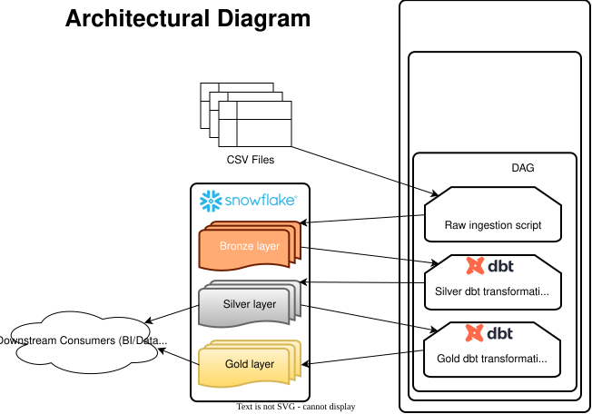

Cloud-Native Medallion Architecture & E-Commerce ELT Pipeline
=============================================================
This project simulates a production-grade data platform processing 1.4M+ e-commerce records, enabling customer segmentation, revenue analytics, and geospatial insights through a fully orchestrated ELT pipeline.

Architecture Overview
======================

The pipeline follows a modern ELT (Extract, Load, Transform) pattern:

Extraction: Python-based ingestion scripts extract raw e-commerce data.

Loading (Bronze): Data is staged into Snowflake using optimized COPY INTO commands.

Transformation (Silver): dbt performs modular cleaning, casting, and schema validation.

Analytics (Gold): Final analytical models (RFM, Geospatial, CLV) are generated for downstream BI.

Orchestration: Apache Airflow (via Astronomer Cosmos) manages task dependencies and lineage.

Infrastructure: Entire stack is containerized using Docker for environment parity.

Tech Stack
==========
Data Warehouse: Snowflake

Transformation: dbt (Data Build Tool)

Orchestration: Apache Airflow / Astronomer Cosmos

Language: Python, SQL

Environment: Docker / Astro CLI

Key Features
============
Medallion Architecture: Logical separation of concerns across Raw (Bronze), Cleansed (Silver), and Mart (Gold) data layers.

Dynamic Orchestration: Utilizes Astronomer Cosmos to automatically map dbt models into Airflow Task Groups, providing granular observability.

Data Quality Assurance: Implemented custom dbt schema tests and casting logic to ensure data type consistency and integrity.

Advanced Analytics: Built specialized models including:

RFM Analysis: Recency, Frequency, and Monetary metrics for customer segmentation.

Geospatial Density: Regional revenue concentration and logistics performance.

CLV (Customer Lifetime Value): Predictive modeling for long-term revenue impact.

Challenges & Technical Solutions
===================================
1. Environmental Resource Constraints (Docker & Airflow)

The Challenge: During development, inconsistent task failures occurred due to leaked semaphore errors within the local Docker-hosted Airflow environment. While the DAG itself was resource-efficient, these environmental race conditions threatened pipeline reliability.

The Solution: Implemented a two-fold strategy:

Infrastructure Tuning: Optimized local Docker resource allocation to stabilize the Airflow worker.

Fault Tolerance: Configured a robust retry policy (retries=2) at the DAG level. This ensures high availability and a seamless "first-run" experience for users by gracefully handling transient environmental blips without manual intervention.

2. Data Normalization (Internationalization/UTF-8)

The Challenge: The source dataset contained Brazilian regional data with inconsistent character encoding. City names were recorded as a mix of accented and unaccented strings (e.g., "São Paulo" vs "Sao Paulo"), which would cause critical join failures and skewed metrics in the Gold layer.

The Solution: Engineered a custom Snowflake UDF (User-Defined Function) to normalize strings into a standardized unaccented format during the Silver transformation layer. This eliminated join inconsistencies caused by encoding differences, ensuring accurate regional revenue reporting.

Setup & Installation
=====================
Prerequisites

    Python 3.9+: Required for local dbt development and script execution.

    Docker Desktop: Required to host the Airflow/Astronomer containerized environment.

    Astro CLI: The interface used to initialize, build, and run the local Airflow stack.

    Snowflake Account: A live instance with ACCOUNTADMIN (or equivalent) privileges to create the initial database and schemas.

    Git: To clone the repository and manage version control.

Clone the Repository:

    Bash
    git clone https://github.com/aobregon1/ecommerce_data_pipeline.git

Configure Environment Variables:

Initialize the .env file in the project root folder with Snowflake credentials

    SNOWFLAKE_USER=""
    SNOWFLAKE_PASSWORD=""
    SNOWFLAKE_ACCOUNT=""
    SNOWFLAKE_WAREHOUSE="COMPUTE_WH"
    SNOWFLAKE_DATABASE="ECOMMERCE_DATA_PIPELINE"
    SNOWFLAKE_SCHEMA="RAW"
    DATA_DIR="/usr/local/airflow/data/"

Initialize Snowflake

Execute the /include/ingestion/createRawTables.sql script in Snowflake to initialize the database, schemas, and bronze-level raw tables.

Initialize Accent Function

Execute the /snowflake_functions/clean_accents.sql script to initialize the clean accents function

Launch with Astro CLI:

astro dev start

Run the Pipeline:

Access the Airflow UI at localhost:8080 and trigger the ecom_full_pipeline DAG.